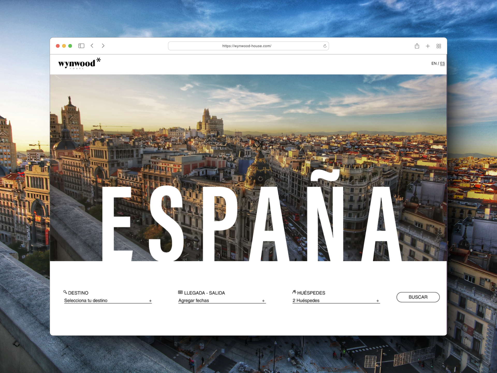

<center>
<h1>WynWood House* Landing</h1>

</center>

### How run the project
#### Step 1: Clone the repository
`git clone https://github.com/royerguerrero/wynwood-house`

#### Step 2: Navigate to the project directory
`cd wynwood-house`

#### Step 3: Create a virtual environment (optional but recommended)
```bash
python3 -m venv env
source env/bin/activate
```

### Step 4: Install the project dependencies
`pip install -r requirements.txt` || `pip install -r dev-requirements.txt`

### Step 5: Apply database migrations
`python manage.py migrate`

### Step 6: Run the development server
`python manage.py runserver`
